# week07_08_lab_20048881_NguyenVanPhu
# Projects Jakarta EE Week 7 + 8
- Sinh viên: **Nguyễn Văn Phú**
# Trang web bán hàng

## BackEnd
- **Ý tưởng:** Lập 1 cho trang web bán hàng.  
- **Sử dụng:** `Spring Boot`    
- **Mô tả:** 
    - Các thao tác `CRUD` cho các đối tượng, lập order.  
- Lập REST API cho các thao tác cần thiết của yêu cầu này (dùng JakartaEE):
- Các thao tác CRUD cho các đối tượng, lập order. (dùng JPA).
- Thống kê order theo ngày, theo khoảng thời gian.
- Thống kê order theo nhân viên bán hàng trong 1 khoảng thời gian.
  -**Diagram:**
- 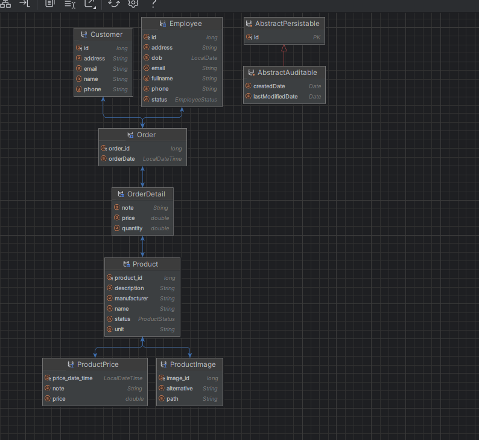

## Front-end
- **Ý tưởng:** Làm dựa trên mô hình MVC.  
- **Sử dụng:** `SPRING BOOT`  `CRUD JPA`  
- **Mô tả:** 
- Tạo các trang web cho việc hiển thị sản phẩm, chọn vào giỏ hàng và thanh toán (giả lập
  việc thanh toán qua thẻ nếu có thể)
- - Thống kê order theo ngày, theo khoảng thời gian.
- Thống kê order theo nhân viên bán hàng trong 1 khoảng thời gian.
  **Demo giao diện kèm video**

- [List Product Manager](#list Product Manager)
- [Product Page](#product-page)
- [Checkout Page](#checkout-page)
- [Add Product](#add-product)
- [Update Product](#update-product)
- [Delete Product](#delete-product)
- [Static Status Product](#staticStatus-product)
- [Static ProductPrice With day-month-year Product](#staticProductPrice-product)
- [Login](#login)

## list Product Manager
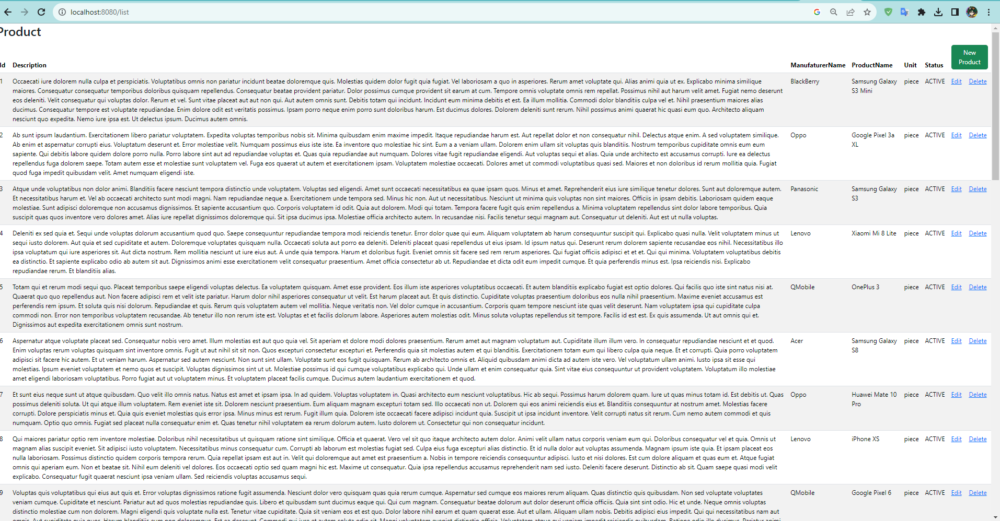

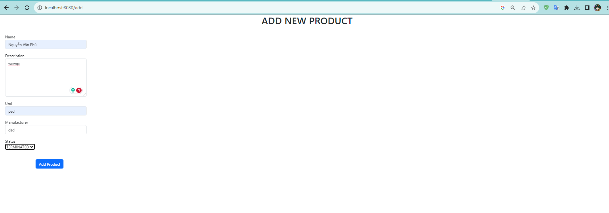
## add-product

## update-product
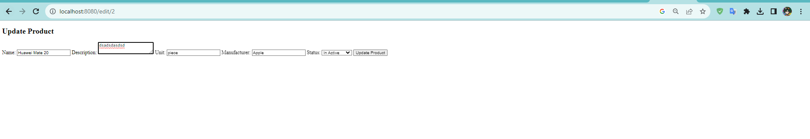

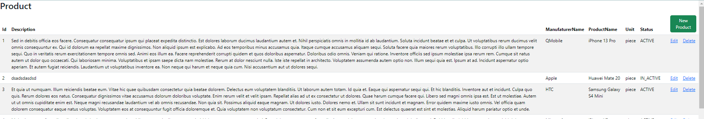
## delete-product
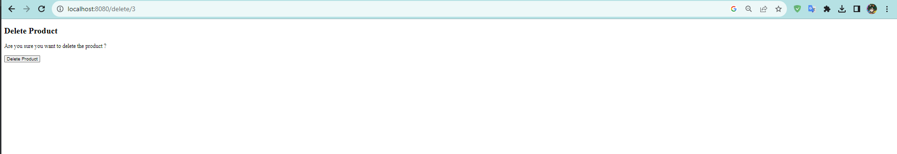

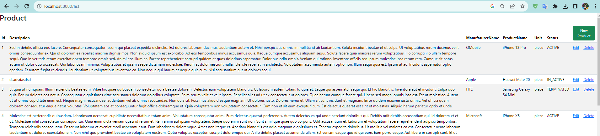
## staticStatus-product
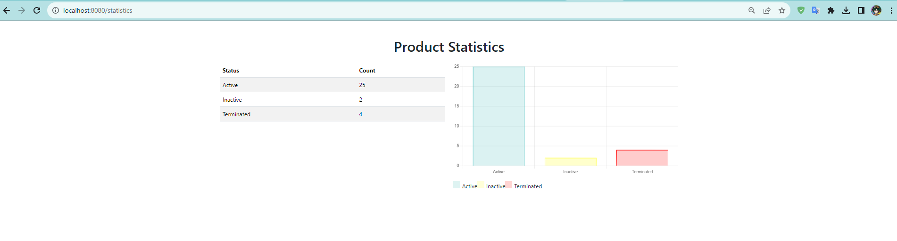
## staticProductPrice-product
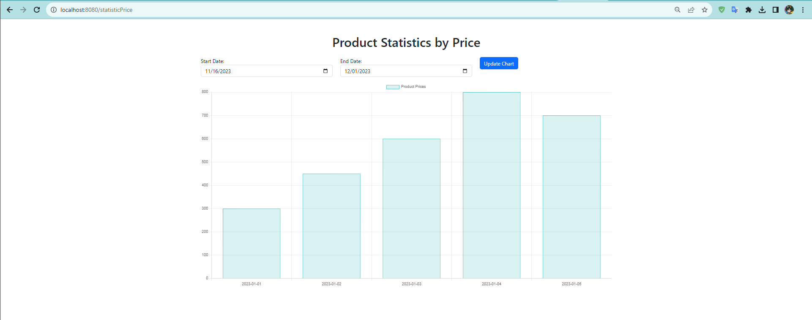
## login
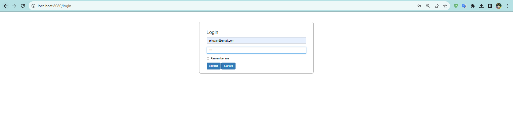
## product-page
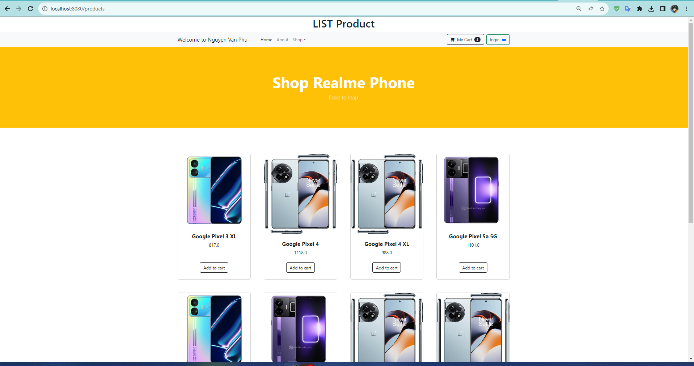
## checkout-page
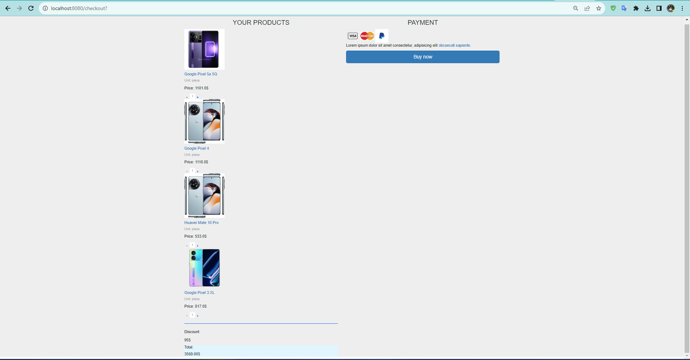
**video demo**
 
-Local: [2023-11-17 18-00-17.mp4](video%20minh%20chung%2F2023-11-17%2018-00-17.mp4)
 
-youtube: https://youtu.be/Wng-nHtqp9o